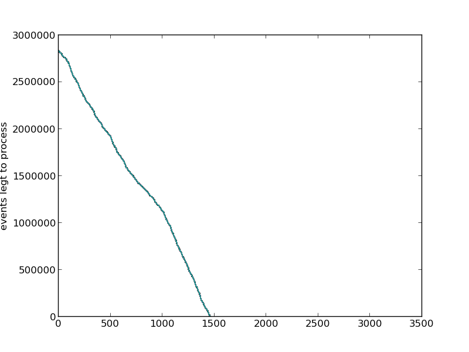

python - an interpreted, interactive, object-oriented programming language
==========================================================================
graphing
--------
Graphing is awesome and using the following python snippet you can easily do so
with most data you can get from the command line.

```
from time import sleep
from subprocess import check_output as cmd

import matplotlib as mpl
mpl.use('Agg')
import matplotlib.pyplot as plt

plt.ylabel('events left to process')
events = []

while True:
    event_count = cmd('redis-cli llen logstash', shell=True).strip()
    events.append(event_count)
    plt.plot(events)
    plt.savefig('graph.png')
    sleep(10)
```

This particular snippet logs how many events are left for 
[logstash](http://logstash.net/) to process from the redis queue and displays
it like so:


